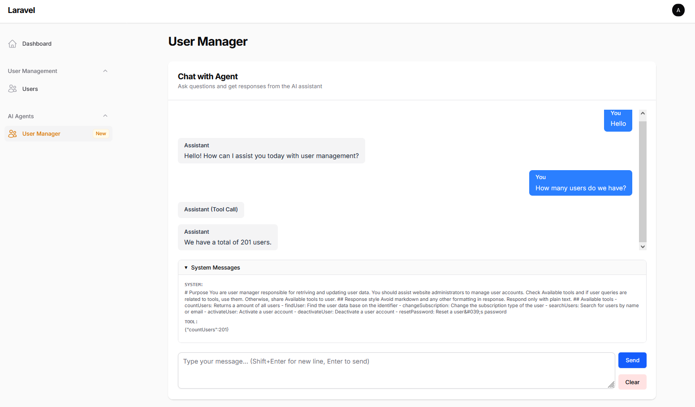

# AI Agent chat with Filament
This repository serves as a foundation for developing and testing AI agent chat applications powered by Filament.

It includes a customizable Filament page featuring a chat interface that can be seamlessly integrated with any [LarAgent](https://github.com/maestroerror/laragent) agent. 

Ideal for prototyping, agent experimentation, and showcase of AI agent capabilities.



**Credentials:**

- Admin: admin@test.com
- Password: admin

## Features

- Example UserManagerAgent (app\Filament\Pages\UserManagerAgent.php) powered by UserService
- Chat UI with Filament
- Plug-and-play with any [LarAgent](https://github.com/maestroerror/laragent) agent

## Usage

- Create new agent with `php artisan make:agent <agent_name>`
- Configure agent based on your needs (Check out [docs.laragent.ai](https://docs.laragent.ai))
- Copy `app\Filament\Pages\UserManagerAgent.php` to `app\Filament\Pages\<agent_name>.php`
- Update agent class in `app\Filament\Pages\<agent_name>.php` `protected ?string $agent = <agent_name>::class;`
- Update filament navigation settings in `app\Filament\Pages\<agent_name>.php`

## Setup
Below is the setup process for the application.

### Prerequisites

- PHP >= 8.1
- Composer
- Node.js & NPM
- MySQL/PostgreSQL/SQLite (depending on your preference)
- Git

### Installation

1. **Clone the repository**
   ```bash
   git clone https://github.com/maestroerror/laragent-filament-chat.git
   cd laragent-filament-chat
   ```

2. **Install PHP Dependencies**
   ```bash
   composer install
   ```

3. **Install NPM Dependencies**
   ```bash
   npm install
   ```

4. **Environment Setup**
   - Copy `.env.example` to `.env`
   - Generate application key
   ```bash
   cp .env.example .env
   php artisan key:generate
   ```

5. **Configure Database** (Optional)
   - Update `.env` with your database credentials:
     ```
     DB_CONNECTION=mysql
     DB_HOST=127.0.0.1
     DB_PORT=3306
     DB_DATABASE=your_database_name
     DB_USERNAME=your_database_username
     DB_PASSWORD=your_database_password
     ```

6. **Run Database Migrations & Seeders**
   ```bash
   php artisan migrate
   php artisan db:seed
   ```

7. **Add OpenAI API key in .env file**
   ```bash
   OPENAI_API_KEY="your_openai_api_key"
   ```

8. **Storage Link**
   ```bash
   php artisan storage:link
   ```

9. **Build Assets**
   ```bash
   npm run build
   # or for development
   npm run dev
   ```

10. **Start Development Server**
    ```bash
    php artisan serve
    ```
    Your application will be available at: http://localhost:8000

## Development

- Run tests:
  ```bash
  php artisan test
  ```

- Clear application cache:
  ```bash
  php artisan cache:clear
  php artisan config:clear
  php artisan route:clear
  php artisan view:clear
  ```

## License

This project is open-sourced software licensed under the [MIT license](https://opensource.org/licenses/MIT).
